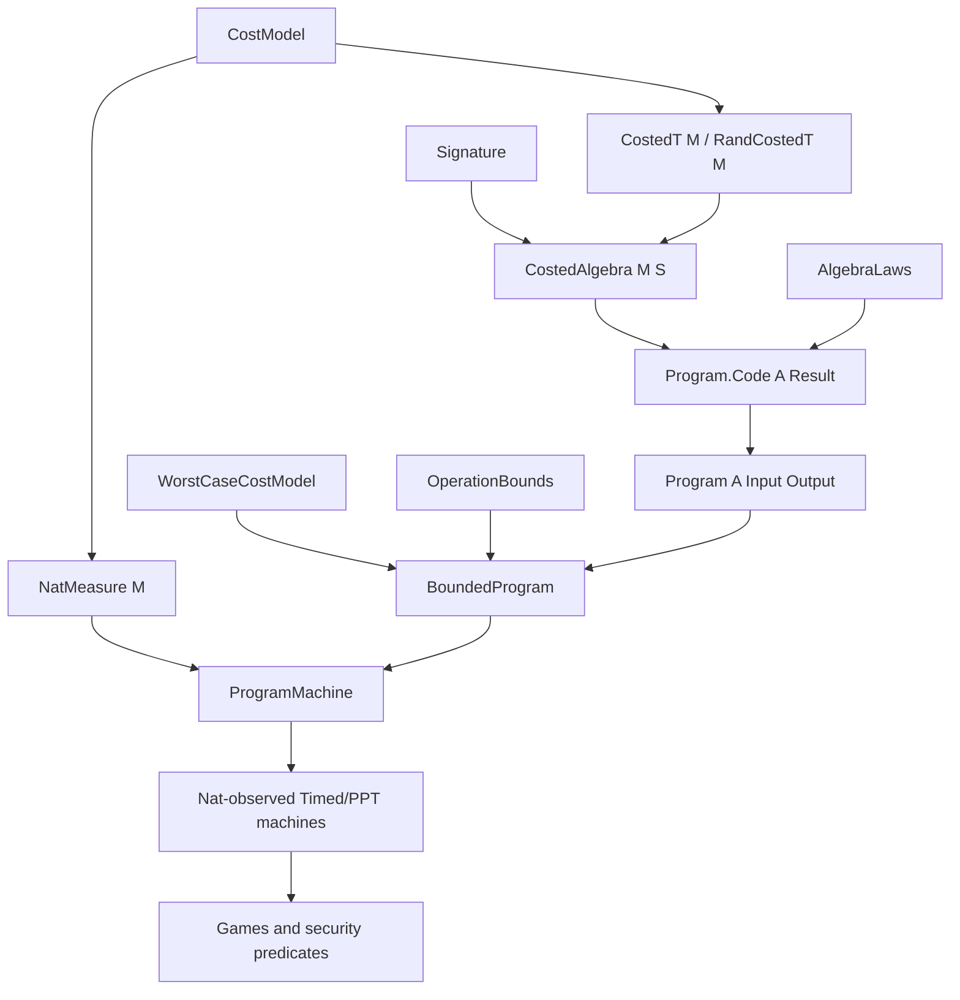

# Cost-aware algebra and generic `Program` migration

This document is the implementation ledger for the repository-wide migration
to generic ordered resource models and typed heterogeneous primitive
operations. It records the final architecture selected on 2026-08-04: the
repository has one generic cost-aware API and does not retain the superseded
fixed-`Nat` or adapter APIs.

A status entry is evidence only when the corresponding command and result are
recorded in the verification section. The final builds and static audits below
were run against the completed working tree on 2026-08-04.

## Baseline and current checkpoint

- Initial planning baseline: `main@d8ba0802be01` on 2026-08-03.
- Baseline verification: `lake build` passed with 1812 jobs.
- Baseline trust scan: no `sorry`, `admit`, `axiom`, or `unsafe` declaration.
- Current checkpoint while this ledger is being updated:
  `main@3d83dfe84d2c` (`使用含复杂度代数重构`).
- The costed-oracle, machine-bound, and test changes that were already present
  at the initial baseline remain migration inputs and must not be discarded.
- No commit or push is part of this migration unless explicitly requested.

The semantic `OracleEnv` remains the cost-erased API used by games and security
definitions. `CostedOracleEnv M` is an exact implementation layer with a proved
erasure map; it does not replace or weaken the semantic interface.

## Final architectural decisions

1. The repository exposes only `CostModel`, `CostedT`, `RandCostedT`, typed
   algebras, and generic programs. Superseded aliases, typeclass adapters,
   duplicate execution records, and fixed-natural-number program surfaces are
   removed rather than deprecated in place.
2. `CostModel.nat` is a normal concrete `CostModel`. It is used when an exact
   natural-number resource is the intended model, not as a compatibility layer.
3. Sequential resource composition uses an ordered `AddMonoid`; it is not
   assumed commutative. Automatic branch bounds additionally use
   `WorstCaseCostModel`, while callers may prove a common bound in any model.
4. Every primitive has exactly one authoritative execution in
   `CostedAlgebra.exec`. `AlgebraLaws` describe cost-erased mathematics and
   probability; `OperationBounds` separately certify upper bounds.
5. Every scheme stage, including decryption, returns `RandCostedT M`.
   Decomposed construction algorithms run their `Program`s directly; an exact
   family setup may itself be the primitive called by a family-level program.
   There is no separately maintained concrete computation path.
6. `Program.runCosted` is the only program interpreter. `Program.valueDist` is
   defined by erasing costs from that interpreter, and `BoundedProgram` pairs
   the same program with a proof rather than copying its syntax.
7. Exact path cost, finite upper-bound certificates, structural query counts,
   and asymptotic complexity are separate layers.
8. `NatMeasure M` is a monotone additive observation from a generic exact cost
   into the existing natural-number complexity interfaces. Mapping a cost does
   not change the value distribution.
9. Oracle query calls always receive an explicit caller-side cost in their
   selected model. Per-name query counts and total query count are structural
   resources, never inferred from runtime.
10. `TimedOracleMachine` requires local-cost, projected-runtime, per-name-query,
    and total-query bounds. `PPTOracleMachine` additionally requires polynomial
    proofs for projected runtime and total queries.
11. Existing games, advantages, correctness statements, `Hard`, DLog/DDH
    `Assumption`, `OneTimeSecure`, `INDCPASecure`, and UC semantics retain their
    names, arbitrary-machine quantification domains, probability semantics, and
    theorem strength.
12. Exact cost semantics remains pathwise. Expected cost, tail bounds,
    communication rounds, encoding size, and parallel composition are outside
    this migration.

## Final dependency structure



## Core interfaces

### Generic costs

```lean
structure CostModel where
  Cost : Type uCost
  instAddMonoid : AddMonoid Cost
  instPartialOrder : PartialOrder Cost
  instAddLeftMono : AddLeftMono Cost
  instAddRightMono : AddRightMono Cost

structure WorstCaseCostModel extends CostModel where
  instSemilatticeSup : SemilatticeSup Cost

structure NatMeasure (M : CostModel) where
  toNat : M.Cost →+ Nat
  monotone_toNat : Monotone toNat
```

- `CostedT M Value` is the deterministic writer value.
- `RandCostedT M Value := PMF (CostedT M Value)` preserves the joint
  distribution of values and exact path costs.
- `CostModel.nat`, `WorstCaseCostModel.nat`, and `NatMeasure.nat` are ordinary
  concrete instances and observations.
- `CostedT.mapCost` and `RandCostedT.mapCost` implement resource observation;
  their erasure theorems prove value-distribution preservation.
- The `Steps × Queries` regression model demonstrates non-scalar exact costs.

### Typed primitive algebra

```lean
structure Signature where
  Op : (Result : Type uResult) → Type uOp

structure CostedAlgebra (M : CostModel) (S : Signature) where
  exec : ∀ {Result}, S.Op Result → RandCostedT M Result
```

`Signature.sum` composes independent capabilities. Arithmetic and sampling are
typed operations, including result-dependent operations such as a scalar sample
whose result type is selected by a public parameter. The exact operation is
defined once in `exec`; a uniformity theorem belongs in `AlgebraLaws`, and a
path-cost bound belongs in `OperationBounds`.

The mathematical hierarchy is capability-based:

- OTP uses a finite additive-group parameter;
- DLog uses a cyclic-action parameter;
- DDH extends that parameter with its stronger commutative multiplication and
  action requirements;
- ElGamal reuses the DDH parameter and algebra rather than restating its
  arithmetic operations.

Projection instances remain explicit or scoped to avoid typeclass diamonds.

### Generic programs and schemes

```lean
inductive Program.Code (A : CostedAlgebra M S) : Type uResult → Type _
  | pure
  | bind
  | call
  | branch

structure Program (A : CostedAlgebra M S)
    (Input : Type uIn) (Output : Type uOut) where
  body : Input → Program.Code A Output
```

- `Program.Code.Execution` records a selected structural path and its exact cost.
- `Program.CostBound p budget` accepts `budget : Input → M.Cost`.
- Structural bound derivation uses operation bounds, ordered sequential
  addition, and either an explicit common branch bound or worst-case supremum.
- `BoundedProgram` stores a `Program` and its bound proof only.
- Symmetric and asymmetric `Scheme M ...` use `RandCostedT M` for setup,
  key generation, encryption, and decryption.
- `setupDist`, `keygenDist`, `encryptDist`, and `decryptDist` are obtained only
  by erasing costs from those exact scheme computations.
- `ProgramMachine` applies an explicit `NatMeasure` and proves that the
  resulting natural-number complexity view has the same value distribution.

### Generic oracle execution

- `OracleProgram M Spec` is the only oracle-program syntax.
- `OracleProfile M Spec` records exact caller-side cost and query trace.
- `OracleProfile.ofQuery localCost name` has no hard-coded query charge.
- `ProbabilisticOracleMachine M` executes that generic syntax.
- `TimedOracleMachine M measure` carries mandatory `costBound`, `runtime`,
  `queryBound`, and `totalQueryBound` fields together with their soundness
  proofs.
- `PPTOracleMachine M measure` carries mandatory polynomial proofs for runtime
  and total-query bounds.
- `CostedOracleEnv M` returns exact implementation cost. Its erasure theorem
  recovers `OracleEnv` without changing response/state distributions.
- Exact composition preserves the interleaving order of local and environment
  work. With the explicit exchange law needed to regroup a noncommutative
  resource, the coarse bound is
  `localBudget + totalQueryBound • envBudget`.
- Applying `NatMeasure` yields the corresponding natural-number complexity
  observation; no separate formula or execution semantics is introduced.

## Zero-compatibility declaration migration

The final repository does not expose two generations of the cost API. The
following migration is removal or direct replacement, not wrapper retention.

| Superseded surface | Final surface | Policy |
| --- | --- | --- |
| `Cost := Nat` | `CostModel.nat.Cost` where a natural model is intended | remove alias |
| `Costed`, `RandCosted` | `CostedT M`, `RandCostedT M` | remove aliases and old namespaces |
| `natCostModel` | `CostModel.nat` | remove alias |
| operation-cost typeclasses | exact typed operations in `CostedAlgebra.exec` | remove classes and bridges |
| additive/multiplicative execution records | one typed algebra selected by the parameter | remove duplicate records |
| standalone uniform-sampling execution record | typed sampling operation plus law and bound | remove wrapper |
| fixed-parameter `Program` | `Program A Input Output` | replace globally |
| duplicated bounded algorithm bodies | `BoundedProgram` over the same `Program` | remove duplicates |
| handwritten `*Computation` algorithm paths | direct `Program.runCosted` scheme fields | remove duplicates |
| natural-only program-machine constructor | generic program plus `NatMeasure` | remove special constructor |
| suffixed generic oracle types | unsuffixed `OracleProfile M`, `OracleProgram M`, `CostedOracleEnv M` | remove parallel names |
| hard-coded unit query charge | explicit query-operation cost | remove implicit charge |
| optional total-query certificate | mandatory machine field and proof | remove optional package |
| runtime-derived total queries | `totalQueryBound` and `totalQueryBound_sound` | prohibit inference |
| OTP dummy scalar | signature containing only sampling, addition, and negation | remove dummy type |
| repeated DLog/DDH/ElGamal arithmetic implementations | shared cyclic-action/DDH algebra | keep one handler |

## Semantic boundary audit

| Boundary | Required final condition |
| --- | --- |
| `OracleEnv`, `OracleSpec`, `OracleFn` | remain cost-erased semantic interfaces |
| ordinary `PPTMachine` and game machines | retain their existing arbitrary-machine domain |
| `Hard` | continue quantifying over arbitrary PPT machines |
| DLog/DDH `Assumption` | retain problem distributions and quantification |
| `OneTimeSecure`, `PerfectOneTimeSecure` | retain adversary domains and advantage conclusions |
| `INDCPASecure` | retain adversary domain and advantage conclusion |
| correctness theorems | retain the same message-level conclusions |
| GameBased, Advantage, Reduction, UC | accept only generic import/type-argument adjustments; no semantic weakening |

The oracle-machine record has new explicit resource fields, but this does not
exclude an adversary admitted before the migration. `withUnitQueryCost`
specializes any natural-cost oracle program by charging each query one while
preserving all non-query work. `totalQueries_le_cost_withUnitQueryCost` and
`totalQueryBound_withUnitQueryCost_of_costBound` prove that its natural cost
bound supplies the required total-query bound, while
`runWithEnv_withUnitQueryCost` proves that the specialization does not change
oracle responses or the machine's output distribution. These use the sole
`runProfiled` interpreter; they are semantic/resource theorems rather than a
parallel compatibility representation.

Program-derived adversaries may be offered as examples or embeddings, but they
must not replace the machine classes quantified by the public security notions.
Any formerly definitional equality that no longer reduces by `rfl` must be
reproved through an explicit erasure or measurement theorem with the same
conclusion.

## Milestone ledger

| Milestone | Exit criterion | Status at this update |
| --- | --- | --- |
| 1. Baseline and decision lock | baseline recorded; root imports include oracle regressions; no user work overwritten | complete |
| 2. Generic cost foundation | only `CostModel`, `CostedT`, `RandCostedT`, and `NatMeasure`; vector-resource regressions pass | complete; focused and aggregate builds pass |
| 3. Typed algebra and Program | one typed handler, separate laws/bounds, one interpreter, input-dependent bounds | complete; focused and aggregate builds pass |
| 4. Concrete algorithms | OTP, DLog, DDH, and ElGamal all generic in `M`, with one algebra and direct programs | complete; focused and aggregate builds pass |
| 5. Oracle composition | explicit query costs, mandatory total-query proof, exact erasure and coarse bounds | complete; unit-charge embedding and composition proofs pass |
| 6. Zero-compatibility cleanup | no superseded aliases, adapter files, duplicate algorithms, or stale imports remain | complete; repository-wide scans have no hits |
| 7. Final verification | focused targets, `Crypto`, `CryptoTest`, full build, trust scan, diff check, and import audit pass | complete |

## Per-file migration ledger

| Area | Files | Final action | Status at this update |
| --- | --- | --- | --- |
| Cost | `Cost/Model.lean`, `Cost/Costed.lean`, `Cost/Distribution.lean`, `Cost/Projection.lean`, `Cost/Basic.lean` | generic exact model only; `CostModel.nat` and `NatMeasure.nat` as concrete definitions | complete; verified |
| Randomized | `Computation/Randomized.lean` | generic `RandomizedComputationT` families only | complete; verified |
| Algebra | `Algebra/Signature.lean`, `Algebra/Operation.lean`, `Algebra/Group.lean`, `Algebra/Basic.lean` | typed signatures, exact handlers, laws, and independent bounds | complete; verified |
| Removed algebra files | `Algebra/Backend.lean`, `Algebra/Costed.lean`, `Algebra/Module.lean` | delete after all imports are migrated | complete; deleted and aggregate build passes |
| Program | `Computation/Program.lean` | generic AST, sole interpreter, exact execution, and nonduplicated bounds | complete; verified |
| Complexity | `Complexity/CostBound.lean`, `Complexity/ProgramMachine.lean`, `Complexity/Machine.lean`, `Asymptotic/Bounds.lean` | explicit generic measurement and mandatory oracle resource proofs | complete; verified |
| Oracle | `Oracle/Interface.lean`, `Oracle/Costed.lean`, `Oracle/Basic.lean` | unsuffixed generic types, explicit query costs, exact erasure and composition | complete; verified |
| Parameter hierarchy | `Assumption/DL/Parameter.lean` | mathematical cyclic-action base and DDH extension only | complete; verified |
| DLog | `Assumption/DL/DLog.lean` and test | one parameter/family algebra, dependent programs, unchanged assumption | complete; verified |
| DDH | `Assumption/DL/DDH.lean` and test | one parameter/family algebra, real/random programs, unchanged assumption | complete; verified |
| OTP | construction, scheme, correctness, one-time security, and test files | generic scheme, no dummy capability, one algebra and direct programs | complete; verified |
| ElGamal | construction, scheme, correctness, IND-CPA, and test files | reuse DDH algebra; generic scheme and direct programs | complete; verified |
| Generic tests | generic cost, cost composition, Program, and resource-bound tests | remove fixed-model aliases and verify vector costs, erasure, branch bounds, and measurement | complete; verified |
| Oracle tests | costed-oracle and resource-bound tests | verify traces, explicit costs, mandatory total bounds, exact and coarse composition | complete; verified |
| Aggregation | `Crypto/Basic.lean`, `CryptoTest.lean`, layer `Basic.lean` files | export only final modules and import every regression | complete; root import audit passes |
| Documentation | `README.md` and this ledger | describe only the zero-compatibility architecture | complete; final evidence recorded |

The scheme syntax and property modules, GameBased, Advantage, Reduction, and UC
are semantic boundaries. Necessary type-argument and import edits are allowed,
but theorem statements and quantified adversary classes must remain unchanged.

## Verification matrix

After each focused edit, run the smallest relevant module or test target. Final
acceptance requires, in order:

```text
lake build Crypto
lake build CryptoTest
lake build
```

Required behavioral coverage:

- ordered sequential identity and associativity, left/right monotonicity, and
  optional worst-case supremum;
- componentwise `Steps × Queries`, `NatMeasure` projection, and value
  distribution preservation;
- deterministic writer bind charging each step once and randomized execution
  retaining value/cost correlation;
- typed signature sum, dependent result types, operation dispatch, erasure
  laws, and independent bounds;
- exact `Program.Code.Execution`, input-dependent budgets, sequencing, branch common
  bounds and supremum, and measured machine conversion;
- OTP with no dummy capability and unchanged perfect one-time security;
- DLog/DDH setup and sampling erasure, exact operation costs, and unchanged
  assumption definitions;
- ElGamal setup, scalar sampling, two scalar actions, addition/subtraction,
  exact path cost, bounds, erased PMFs, timed conversion, and correctness;
- oracle erasure, query traces, per-name and total bounds, exact internal cost,
  coarse composition, and polynomial closure;
- unchanged arbitrary-PPT quantification for `Hard` and public security
  predicates.

Final static checks:

```text
rg -n '\b(sorry|admit)\b|^\s*axiom\b|\bunsafe\b' Crypto CryptoTest
rg -n '(^|[^[:alnum:]_.])(Costed|RandCosted)\b|\b(natCostModel|AddCost|MulCost|NegCost|SubCost|SMulCost|AdditiveBackend|MultiplicativeBackend|UniformSampler|OracleProgramT|OracleProfileT|CostedOracleEnvT|TotalQueryBoundCertificate|PolyTotalQueryBoundCertificate)\b' Crypto CryptoTest
rg -n '\bProgram\.cost\b|\bUnusedScalar\b|\bofNatBoundedProgram\b' Crypto CryptoTest
rg -n '\b(keygen|encrypt|decrypt|setup|sample|real|random)Computation\b' Crypto CryptoTest --glob '*.lean'
git diff --check
git status --short
```

The first four source scans must have no hits.
The root test module must import every regression file.

### Final verification evidence

| Command | Result |
| --- | --- |
| focused generic-cost, Program, Oracle, OTP, DLog, DDH, and ElGamal targets | passed, 3186 jobs, no warnings |
| `lake build Crypto` | passed, 1775 jobs, no warnings |
| `lake build CryptoTest` | passed, 3189 jobs, no warnings |
| `lake build` | passed, 3220 jobs, no warnings |
| trust-marker scan | passed; no `sorry`, `admit`, `axiom`, or `unsafe` hits |
| superseded-API source scan | passed; no hits |
| duplicate algorithm/interpreter scan | passed; no hits |
| `git diff --check` | passed |
| root test-import audit | passed; all nine regression modules imported |

The trust audit also reviewed newly noncomputable declarations. They construct
or package `PMF` computations (including finite uniform sampling), typed
handlers containing those computations, or programs and certificates depending
on those handlers. They introduce no `unsafe` execution path and no additional
probability or cost interpreter.

## Risks and controls

| Risk | Consequence | Control |
| --- | --- | --- |
| Genericization accidentally assumes commutative cost addition | invalid ordered resource semantics | require only `AddMonoid`; keep sequential-order tests |
| A second evaluator survives in a construction | probability or cost semantics can drift | scheme fields run `Program.runCosted`; scan for duplicate computation bodies |
| Bounds become a second source of cost | exact execution and certificates disagree | bounds quantify over handler-produced paths only |
| DLog/DDH repacking changes dependent projections | casts obscure or alter distributions | use dependent typed operations and explicit erasure theorems |
| ElGamal restates DDH arithmetic | duplicate implementations can diverge | delegate to the public parameter's DDH algebra |
| Query count is inferred from cost or runtime | zero-cost queries invalidate the bound | require independent per-name and total structural proofs |
| Mandatory oracle fields narrow a public security notion | theorem strength changes | keep public notions quantified over their established arbitrary machine type and audit statements |
| Global algebra instances overlap Mathlib | elaboration ambiguity or proof instability | use explicit projections and scoped/local instances |
| Old `rfl` proofs stop elaborating | tempting theorem weakening | prove the same conclusion through erasure/measurement equivalence |
| A stale adapter survives through an aggregation import | two public APIs remain | scan declarations and imports before final build |
| Existing user work is overwritten | loss of migration input | never reset or revert unrelated changes; inspect diffs before edits |

## Decision log

| Date | Decision | Reason |
| --- | --- | --- |
| 2026-08-03 | Treat the existing costed-oracle and bound changes as migration inputs. | They were user-owned work already present in the checkout. |
| 2026-08-03 | Use ordered generic exact costs, typed heterogeneous operations, and one program interpreter. | This supports dependent cryptographic operations and vector resources without duplicating semantics. |
| 2026-08-03 | Keep probability semantics, exact costs, finite bounds, and asymptotic bounds separate. | Each layer has a different mathematical role. |
| 2026-08-03 | Preserve semantic games and arbitrary PPT quantification. | Program-only adversaries would weaken public security notions. |
| 2026-08-04 | Remove every superseded compatibility surface instead of retaining natural-number aliases or adapters. | The repository should expose one current architecture with one source of exact cost. |
| 2026-08-04 | Treat `CostModel.nat` as an ordinary model and `NatMeasure` as observation into existing complexity interfaces. | Natural-number use should not create a parallel API. |
| 2026-08-04 | Make all scheme stages `RandCostedT M` and run construction programs directly. | Deterministic stages are point distributions in the same exact semantics. |
| 2026-08-04 | Use one generic oracle syntax with explicit query cost and mandatory total-query evidence. | Query count is structural and cannot soundly be recovered from runtime. |
| 2026-08-04 | Reuse one algebra across DLog, DDH, OTP, and ElGamal within their parameter families. | Duplicate arithmetic implementations would recreate multiple cost sources. |

## Completion report requirements

The final implementation report must include:

1. the final architecture and direct declaration replacements;
2. exact files changed and deleted, including preserved pre-existing work;
3. confirmation that no compatibility surface or duplicate interpreter remains;
4. focused and full build commands with actual outcomes;
5. confirmation that security statements and adversary domains retain their
   original strength;
6. trust scan, stale-API scan, diff check, and root-import audit results;
7. any justified `noncomputable` additions and the remaining intentionally
   deferred resource notions.
