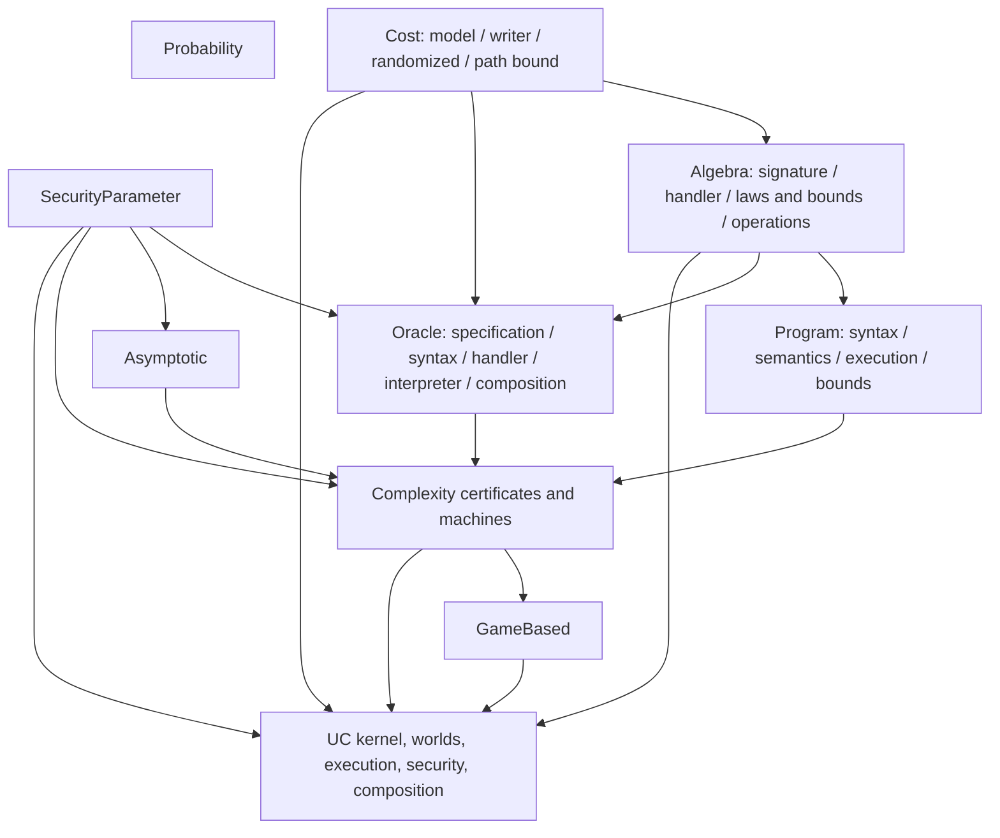

# Infrastructure strict hierarchy migration

This ledger records the repository-wide Infrastructure migration started from
`main@87d3c330793b840c79208dcb3cbf54dcc22131ef` on 2026-08-04.  That baseline
was clean, built locally, and was green in GitHub Actions.  The migration keeps
no compatibility API for the superseded fixed-`Nat`, ordinary/dependent
machine, unit-query-cost, or semantic-only UC layers.

Status in this document is deliberately evidence-based.  A module is marked
complete only after its focused Lake target has built from the current working
tree.  Repository-wide acceptance is recorded only after all three final build
commands and every static audit have passed on the migrated working tree.

## Dependency law



The diagram records the permitted logical flow, not an assertion that every
arrow is a direct Lean import. `SecurityParameter`, `Probability`, and
`Cost.Model` are independent roots; `Probability` currently has no direct
Infrastructure consumer. The executable checker
`scripts/check_infrastructure_imports.py` rejects both cycles and upward
imports. CI runs it before Lean. Aggregation modules may import all members of
their own completed layer, but implementation modules must follow the
subsystem order encoded by the checker.

## Locked decisions

- `CryptoLib.Core.SecPar` lives in `CryptoLib.Core.Infrastructure.SecurityParameter`; neither
  computation nor probability imports asymptotics.
- Exact sequential cost is an ordered, potentially noncommutative additive
  monoid.  A worst-case capability reuses that exact order and supplies only a
  supremum operation and its three laws.
- `RandCosted.CostBound` is the only path-cost predicate.  Program, machine,
  Oracle, and UC certificates quantify or compose that predicate rather than
  defining another notion of path cost.
- `NatMeasure` is a monotone additive observation.  It is used in proofs and
  certificates; it never rewrites a machine's exact run.
- A typed `CostedAlgebra.exec` is the only source of a primitive's exact cost.
  Mathematical/distributional laws and upper bounds are separate records.
- `Program.runCosted` and Oracle `Program.runExact` are their respective sole
  recursive interpreters. Every probability, value, or trace view is a map or
  erasure of those interpreters.
- There is one dependent machine core.  Ordinary inputs/outputs are constant
  families.  Timed records attach annotation certificates to the same run;
  PPT records additionally carry host-independent admission indexed by that
  run and its claimed runtime.
- Security predicates explicitly select an adversary cost model and
  `NatMeasure`, then quantify every PPT machine admitted by those parameters.
  Construction and adversary cost models remain independent.
- UC fuel controls only finite scheduling.  Timeout and deadlock are observable
  runner outcomes and map to `false`; a cost or fuel certificate never changes
  execution or filters a distribution.
- `Protocol` and `IdealFunctionality`, and likewise Environment, Adversary, and
  Simulator, are distinct types.  Real and ideal composition must install the
  named components into an actual typed closed-world kernel configuration.
- An `Environment` has an intrinsically Boolean terminal output family
  (`ULift Bool` for universe polymorphism).  The public execution observes only
  environment-owned output; no experiment-level function may reinterpret an
  arbitrary machine value outside the certified execution.
- One executable experiment owns one corruption policy.  Real and ideal data
  are indexed by that same policy, and a context supplies one shared
  `plugPolicy` transformation for both sides.

## Certificate chains

### Generic machine

```text
RandCosted.CostBound
  -> ExactCostCertificate(input-dependent exact budget)
  -> RuntimeCertificate(NatMeasure, uniform runtime)
  -> PolyRuntimeCertificate(polynomial runtime)
  +  PPTAdmissible(the same run and runtime)
  -> PPTMachine(the same exact run)
```

### Oracle composition

```text
caller local exact bound + structural total-query bound
  + implemented-oracle exact query bound
  -> localBudget + totalQueryBudget • envBudget
  -> NatMeasure.map_nsmul
  -> localRuntime + totalQueryRuntime * envRuntime
  -> polynomial runtime certificate + closed-run PPT admission
  -> composed PPT machine
```

The generic exact theorem requests `CostExchange` only when regrouping
interleaved noncommutative caller/environment work.  Query counts are never
inferred from runtime or exact cost.

### UC closed world

```text
component handler bounds + KernelAlgebra bounds
  -> structural one-step exact certificate (ten ordered cost atoms)
  -> repeated activation exact certificate
  -> NatMeasure.map_nsmul
  -> polynomial activation limit * polynomial step runtime
  +  operational admission of the same closed runner and runtime
  -> PPT execution certificate + independent NoFuelTimeout/stability proof
```

## Migration ledger

| Area | Files or declarations | Current status |
| --- | --- | --- |
| Security parameter | `SecurityParameter.lean`; old Asymptotic file removed | focused build passed |
| Probability | `Probability/Uniform.lean`, `Probability/Basic.lean`; old `Computation/Distribution.lean` removed | focused and consumer builds passed |
| Cost | `Model -> Writer -> Randomized -> PathBound`; `Measure -> Projection` | `Cost.Basic` passed |
| Algebra | `Signature -> Handler -> Laws/Bounds -> Operation`; shared `Parameter` | `Algebra.Basic` passed |
| Program | `Syntax -> Semantics -> Execution/Bounds -> Basic` | `CryptoLib.Program.Basic` passed, including execution/support iff |
| Machine | unified dependent `ProbabilisticMachine`, annotation-level `TimedMachine`, and operationally admitted `PPTMachine` | `Complexity.Basic` passed; host-function bypass regressions included |
| Program adapter | exact generic run retained; measurement used only in certificates | focused build passed |
| GameBased | pure indistinguishability; separate distinguishing/search; old Reduction removed | non-Oracle `GameBased.Basic` passed |
| DLog/DDH | explicit adversary model/measure with all-PPT quantification | modules and direct tests passed |
| OTP/ElGamal | generic machine consumers; OTP setup/keygen/encrypt/decrypt and ElGamal algorithms all execute through typed Programs; no dummy scalar or mapped-cost run | construction, schemes, correctness/security consumers, and direct tests passed |
| Oracle computation | pure cost-free query syntax; exact handlers in `Handler`; path certificates in `Bounds`; one interpreter with trace and cost separated | `Computation.Oracle.Basic` and `Computation.Basic` passed |
| Oracle complexity/security | implementation/machine certificates and Oracle distinguishing | focused modules and Oracle regression tests passed |
| UC kernel | typed ports/messages, dependent store, FIFO activation/corruption events, dynamic send-as, dormant-target corruption, and charged kernel | `UC.Kernel` and kernel regression test passed |
| UC complexity | handler/kernel bounds derive the ordered ten-atom step bound; repeated exact, measured, polynomial, admission, and fuel certificates index the same runner | `UC.Complexity` passed |
| UC worlds/security | distinct wrappers, one shared corruption policy, intrinsic Boolean environment output, real/ideal wiring, common-fuel role independence, and Context step-to-run simulation | focused modules passed; policy and positive-fuel observation regressions included in final acceptance |
| UC context | one typed `SystemHole.fill`, structural `ContextBuilder`, shared `plugPolicy`, role/port/configuration transport, operational simulation, identity/associativity, and `uc_compose` | production and positive-fuel structural regression passed |
| UC layered | session-aware party addresses, total party/manager/boundary dispatcher, full-address MPC functionality, and one layered policy indexing both worlds | production bridge, four-role dispatch, and FIFO broadcast-handler exact-cost regression passed |
| Removed empty surfaces | `GameBased.Reduction`, `ProofPattern.Basic`, empty `CryptoLib.Core.Protocol.Basic` | source files removed; aggregate build and stale-name scan passed |
| CI | import checker; explicit Linux `CryptoLib.Core`/`CryptoLib.Test`/default builds; Jekyll disabled; docgen on every push with Pages deployment only from `main` | workflow updated; latest baseline run `30867757068` is green; the unpushed migration awaits its own remote run |

## Semantic boundaries to audit

- `Game`, `Advantage`, correctness distributions, and scheme probability APIs
  must remain cost-erased and must not acquire an adversary cost parameter.
- DLog/DDH assumptions, one-time security, IND-CPA, and UC security must retain
  quantification over all operationally admitted PPT adversaries of the
  selected model, not only those generated by the program syntax. Polynomial
  path annotations alone must never construct such admission.
- `OracleEnv` remains the semantic handler.  `CostedOracleEnv.erase` must prove
  value/state preservation, and a named zero-cost lift must use the same exact
  interpreter.
- Exact Oracle support implies environment-independent `PossibleExecution`;
  no converse may be claimed without response-support assumptions.
- A UC corruption request is a separate FIFO event.  When dequeued it leaks the
  current state after all previously committed erasure actions, removes honest
  state, records corruption, and queues typed leakage to the adversary.
- Within one experiment, real and ideal executions share the same environment,
  corruption policy, routing policy, and fuel convention; only
  protocol/adversary versus functionality/simulator changes. The terminal bit
  is the environment machine's typed Boolean output, not a separately supplied
  observation function. A surrounding context maps an outer environment to the
  same inner environment and the same transformed policy on both sides, while
  its simulator transformation remains independent of that environment.

## Risks and decisions log

- Dependent family dispatch can require equality transport.  Components use
  result/address indices and proof-carrying endpoints rather than `Any` or
  `Dynamic`; scoped/local instances are preferred over blanket instances.
- Noncommutative exact cost prevents silently regrouping local and Oracle work.
  Coarse regrouping therefore has an explicit exchange hypothesis.
- A structural possible-path relation intentionally overapproximates Oracle
  responses.  Only the support-to-path direction is generally valid.
- A higher-order Lean program still does not model host reduction cost.  This
  migration certifies explicit algebra operations and kernel actions; it does
  not claim a first-order RAM/Turing-machine metatheory.
- Context composition stores one-step erased kernel simulations, not final game
  equalities. Configuration transport covers the dependent store, FIFO queue,
  corrupted set, output, policy, ports, and network adapter; arbitrary-fuel run
  equivalence and the final UC theorem are derived from those local laws. One
  `SystemHole.fill` supplies the inner system, `ContextBuilder` cannot inject an
  unrelated outer system, and a single policy transformation is used on both
  sides of every plug.
- GitHub's failed runs at `3d83dfe8` and `c688560d` mixed build and documentation
  publication state. Both Lean/doc-generation phases completed (8087 and 8078
  jobs respectively), but Jekyll failed because source `docs/` had no Gemfile.
  Baseline `87d3c330` fixed this by selecting `generated-docs`; the new workflow
  also names all build targets, pins the docgen action revision, disables the
  inapplicable Jekyll phase, generates documentation on every push, and enables
  deployment only when that push targets `main`.

## Final acceptance

The following commands were executed in order from the final working tree:

```text
python3 scripts/check_infrastructure_imports.py
lake build CryptoLib.Core
lake build CryptoLib.Test
lake build
rg -n '\b(sorry|admit)\b|^\s*axiom\b|\bunsafe\b' CryptoLib/Core CryptoLib/Test
rg -n '^opaque .*Admissible' CryptoLib/Core
git diff --check
git status --short
```

The final migrated working tree passed:

- Project imports resolve with exact case, and the Infrastructure hierarchy has
  65 modules with no cycle or upward import.
- `lake build CryptoLib.Core`: 1803 jobs, no warnings.
- `lake build CryptoLib.Test`: 3228 jobs, no warnings.
- `lake build`: 3252 jobs, no warnings.
- no `sorry`, `admit`, explicit `axiom`, or `unsafe` in `CryptoLib/Core` or
  `CryptoLib/Test`; the opaque admission relations expose the operational trust
  boundary but provide no global fact or generic host-function constructor.
- no stale removed API in source or tests; the scan's only matches are this
  ledger's removal record and the theorem-neutral `INDCPA.lean` module name.
- `git diff --check`: clean.

The stale-name and structural scans also found no second recursive Program or
Oracle interpreter, unit query charge, dummy scalar type, blanket algebra
instance, ordinary/dependent machine duplicate, or cost parameter added to an
erased game.  GitHub run `30863398909` had completed Lean and documentation
generation before Jekyll failed because the old workflow treated source
`docs/` as a generated site without a Gemfile.  Baseline run `30867757068`
confirmed the `generated-docs` fix.  This migration itself remains deliberately
uncommitted and unpushed, so a remote Linux run for this exact tree requires a
future authorized push.
